# Vlogger
[](https://arxiv.org/abs/2401.09414)
[](https://zhuangshaobin.github.io/Vlogger.github.io/)
[](https://hits.seeyoufarm.com)

This repository is the official implementation of [Vlogger](https://arxiv.org/abs/2401.09414):

**[Vlogger: Make Your Dream A Vlog](https://arxiv.org/abs/2401.09414)**

Demo generated by our Vlogger: [Teddy Travel](https://youtu.be/ZRD1-jHbEGk)


Below is the compressed version of [Teddy Travel](https://youtu.be/ZRD1-jHbEGk).

<iframe width="1024" height="640" src="[https://www.youtube.com/embed/ZRD1-jHbEGk?si=xkRJQd8MLsHlyQzi](https://github.com/zhuangshaobin/Vlogger/releases/download/demo/Teddy_Travel.mp4)" title="Teddy Travel" frameborder="0" allow="accelerometer; autoplay; clipboard-write; encrypted-media; gyroscope; picture-in-picture; web-share" allowfullscreen></iframe>


##  Setup

### Prepare Environment
```
conda create -n vlogger python==3.10.11
conda activate vlogger
pip install -r requirements.txt
```

### Download our model and T2I base model

Our model is based on Stable diffusion v1.4, you may download [Stable Diffusion v1-4](https://huggingface.co/CompVis/stable-diffusion-v1-4) and [OpenCLIP-ViT-H-14](https://huggingface.co/laion/CLIP-ViT-H-14-laion2B-s32B-b79K) to the director of ``` pretrained ```
.
Download our model(ShowMaker) checkpoint (from [google drive](https://drive.google.com/file/d/1pAH73kz2QRfD2Dxk4lL3SrHvLAlWcPI3/view?usp=drive_link) or [hugging face](https://huggingface.co/GrayShine/Vlogger/tree/main)) and save to the directory of ```pretrained```


Now under `./pretrained`, you should be able to see the following:
```
├── pretrained
│   ├── ShowMaker.pt
│   ├── stable-diffusion-v1-4
│   ├── OpenCLIP-ViT-H-14
│   │   ├── ...
└── └── ├── ...
        ├── ...
```
## Usage
### Inference for LLM planning and make reference image
Run the following command to get script, actors and protagonist:
```python
python sample_scripts/vlog_write_script.py
```
The generated scripts will be saved in ```results/vlog/$your_story_dir/script```.

The generated reference images will be saved in ```results/vlog/$your_story_dir/img```.

!!!important: Enter your openai key in the 7th line of the file ```vlogger/planning_utils/gpt4_utils.py```
### Inference for vlog generation
Run the following command to get the vlog:
```python
python sample_scripts/vlog_read_script_sample.py
```
The generated scripts will be saved in ```results/vlog/$your_story_dir/video```.

### Inference for (T+I)2V 
Run the following command to get the (T+I)2V results:
```python
python sample_scripts/with_mask_sample.py
```
The generated video will be saved in ```results/mask_no_ref```.
### Inference for (T+I+Ref)2V 
Run the following command to get the (T+I+Ref)2V results:
```python
python sample_scripts/with_mask_ref_sample.py
```
The generated video will be saved in ```results/mask_ref```.


#### More Details
You may modify ```configs/with_mask_sample.yaml``` to change the (T+I)2V conditions.

You may modify ```configs/with_mask_ref_sample.yaml``` to change the (T+I+Ref)2V conditions.
For example:

```ckpt``` is used to specify a model checkpoint.

```text_prompt``` is used to describe the content of the video.

```input_path``` is used to specify the path to the image.

```ref_path``` is used to specify the path to the reference image.

```save_path``` is used to specify the path to the generated video.


## Results
### (T+Ref)2V Results
<table class="center">
<tr>
  <td style="text-align:center;width: 50%" colspan="1"><b>Reference Image</b></td>
  <td style="text-align:center;width: 50%" colspan="1"><b>Output Video</b></td>
</tr>
<tr>
  <td>
      <br>
<!--       <div class="text" style=" text-align:center;">
        Scene Reference
      </div> -->
      <p align="center">Scene Reference</p>
  </td>
  <td>
      
      <br>
<!--       <div class="text" style=" text-align:center;">
        Fireworks explode over the pyramids.
      </div> -->
          <p align="center">Fireworks explode over the pyramids.</p>
  </td>
</tr>

<tr>
  <td>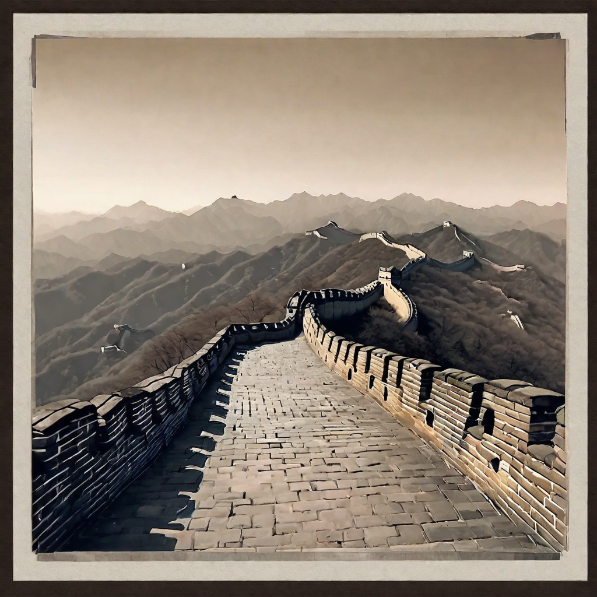
      <br>
<!--       <div class="text" style=" text-align:center;">
        Scene Reference
      </div> -->
      <p align="center">Scene Reference</p>
  </td>
  <td>
      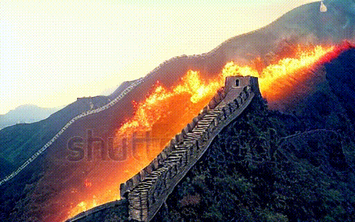
      <br>
<!--       <div class="text" style=" text-align:center;">
        The Great Wall burning with raging fire.
      </div> -->
          <p align="center">The Great Wall burning with raging fire.</p>
  </td>
</tr>

<tr>
  <td>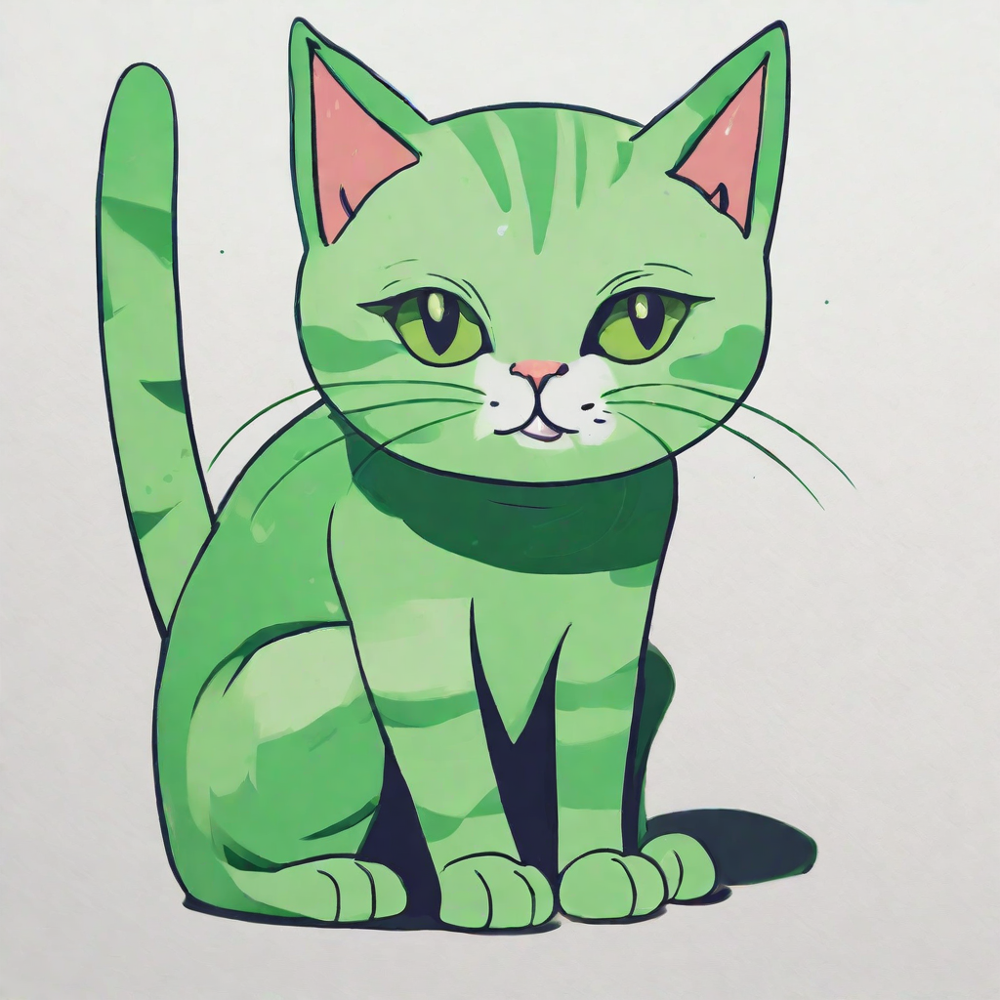
      <br>
<!--       <div class="text" style=" text-align:center;">
        Object Reference
      </div> -->
      <p align="center">Object Reference</p>
  </td>
  <td>
      
      <br>
<!--       <div class="text" style=" text-align:center;">
        A cat is running on the beach.
      </div> -->
          <p align="center">A cat is running on the beach.</p>
  </td>
</tr>

</table>

### (T+I)2V Results
<table class="center">
<tr>
  <td style="text-align:center;width: 50%" colspan="1"><b>Input Image</b></td>
  <td style="text-align:center;width: 50%" colspan="1"><b>Output Video</b></td>
</tr>
<tr>
  <td>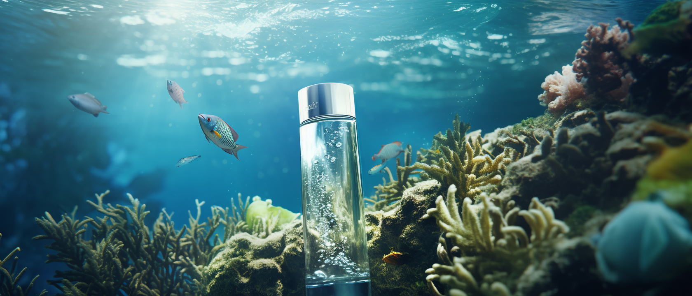</td>
  <td>
      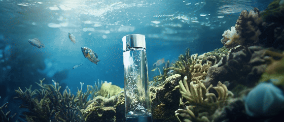
      <br>
<!--       <div class="text" style=" text-align:center;">
        Underwater environment cosmetic bottles.
      </div> -->
          <p align="center">Underwater environment cosmetic bottles.</p>
  </td>
</tr>

<tr>
  <td></td>
  <td>
      
      <br>
<!--       <div class="text" style=" text-align:center;">
        A big drop of water falls on a rose petal.
      </div> -->
          <p align="center">A big drop of water falls on a rose petal.</p>
  </td>
</tr>

<tr>
  <td>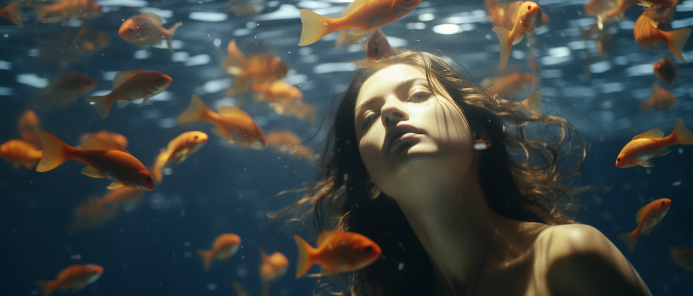</td>
  <td>
      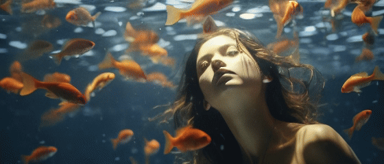
      <br>
<!--       <div class="text" style=" text-align:center;">
        A fish swims past an oriental woman.
      </div> -->
          <p align="center">A fish swims past an oriental woman.</p>
  </td>
</tr>

<tr>
  <td></td>
  <td>
      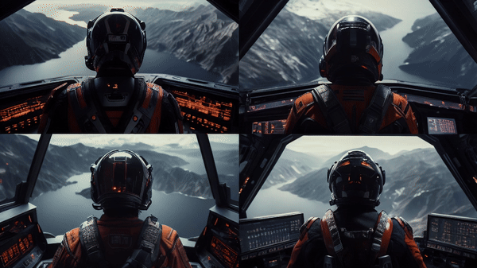
      <br>
<!--       <div class="text" style=" text-align:center;">
        Cinematic photograph. View of piloting aaero.
      </div> -->
          <p align="center">Cinematic photograph. View of piloting aaero.</p>
  </td>
</tr>

<tr>
  <td></td>
  <td>
      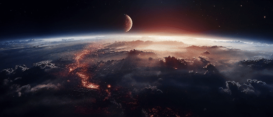
      <br>
<!--       <div class="text" style=" text-align:center;">
        Planet hits earth.
      </div> -->
          <p align="center">Planet hits earth.</p>
  </td>
</tr>
</table>


### T2V Results
<table>
<tr>
  <td style="text-align:center;width: 66%" colspan="2"><b>Output Video</b></td>
</tr>
<tr>
  <td>
      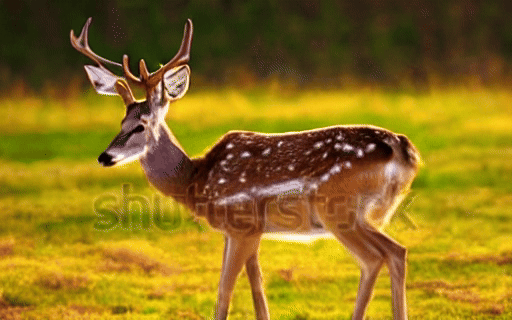
      <br>
<!--       <div class="text" style=" text-align:center;">
        A deer looks at the sunset behind him.
      </div> -->
          <p align="center">A deer looks at the sunset behind him.</p>
  </td>
  <td>
      
      <br>
<!--       <div class="text" style=" text-align:center;">
        A duck is teaching math to another duck.
      </div> -->
          <p align="center">A duck is teaching math to another duck.</p>
  </td>
</tr>
<tr>
  <td>
      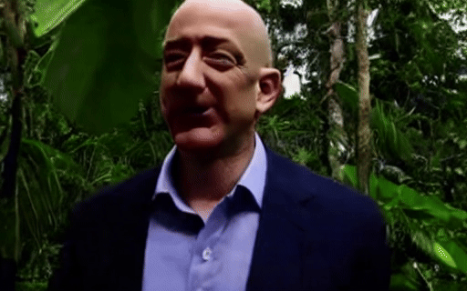
      <br>
<!--       <div class="text" style=" text-align:center;">
        Bezos explores tropical rainforest.
      </div> -->
          <p align="center">Bezos explores tropical rainforest.</p>
  </td>
  <td>
      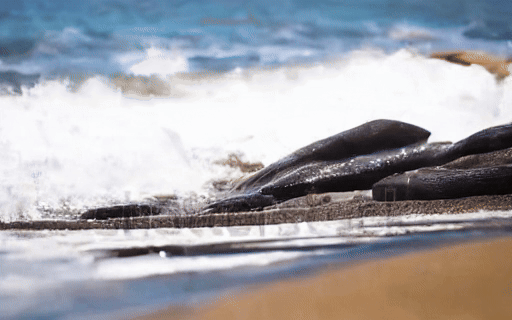
      <br>
<!--       <div class="text" style=" text-align:center;">
        A deer looks at the sunset behind him.
      </div> -->
          <p align="center">A deer looks at the sunset behind him.</p>
  </td>
</tr>

</table>

## BibTeX
```bibtex
@article{zhuang2024vlogger,
title={Vlogger: Make Your Dream A Vlog},
author={Zhuang, Shaobin and Li, Kunchang and Chen, Xinyuan and Wang, Yaohui and Liu, Ziwei and Qiao, Yu and Wang, Yali},
journal={arXiv preprint arXiv:2401.09414},
year={2024}
}
```

```bibtex
@article{chen2023seine,
title={SEINE: Short-to-Long Video Diffusion Model for Generative Transition and Prediction},
author={Chen, Xinyuan and Wang, Yaohui and Zhang, Lingjun and Zhuang, Shaobin and Ma, Xin and Yu, Jiashuo and Wang, Yali and Lin, Dahua and Qiao, Yu and Liu, Ziwei},
journal={arXiv preprint arXiv:2310.20700},
year={2023}
}
```

```bibtex
@article{wang2023lavie,
  title={LAVIE: High-Quality Video Generation with Cascaded Latent Diffusion Models},
  author={Wang, Yaohui and Chen, Xinyuan and Ma, Xin and Zhou, Shangchen and Huang, Ziqi and Wang, Yi and Yang, Ceyuan and He, Yinan and Yu, Jiashuo and Yang, Peiqing and others},
  journal={arXiv preprint arXiv:2309.15103},
  year={2023}
}
```

## Disclaimer
We disclaim responsibility for user-generated content. The model was not trained to realistically represent people or events, so using it to generate such content is beyond the model's capabilities. It is prohibited for pornographic, violent and bloody content generation, and to generate content that is demeaning or harmful to people or their environment, culture, religion, etc. Users are solely liable for their actions. The project contributors are not legally affiliated with, nor accountable for users' behaviors. Use the generative model responsibly, adhering to ethical and legal standards.

## Contact Us
**Shaobin Zhuang**: [zhuangshaobin@pjlab.org.cn](mailto:zhuangshaobin@pjlab.org.cn)

**Kunchang Li**: [likunchang@pjlab.org.cn](mailto:likunchang@pjlab.org.cn)

**Xinyuan Chen**: [chenxinyuan@pjlab.org.cn](mailto:chenxinyuan@pjlab.org.cn)

**Yaohui Wang**: [wangyaohui@pjlab.org.cn](mailto:wangyaohui@pjlab.org.cn)  

## Acknowledgements
The code is built upon [SEINE](https://github.com/Vchitect/SEINE), [LaVie](https://github.com/Vchitect/LaVie), [diffusers](https://github.com/huggingface/diffusers) and [Stable Diffusion](https://github.com/CompVis/stable-diffusion), we thank all the contributors for open-sourcing. 


## License
The code is licensed under Apache-2.0, model weights are fully open for academic research and also allow **free** commercial usage. To apply for a commercial license, please contact zhuangshaobin@pjlab.org.cn.
=======
